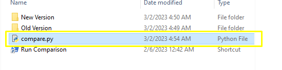
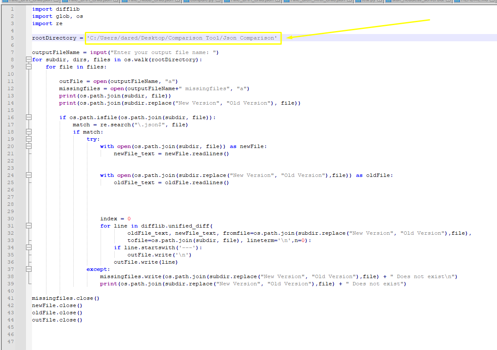
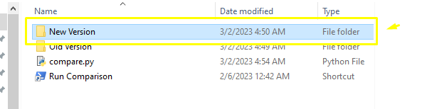
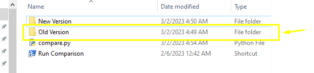
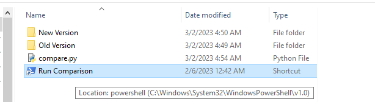
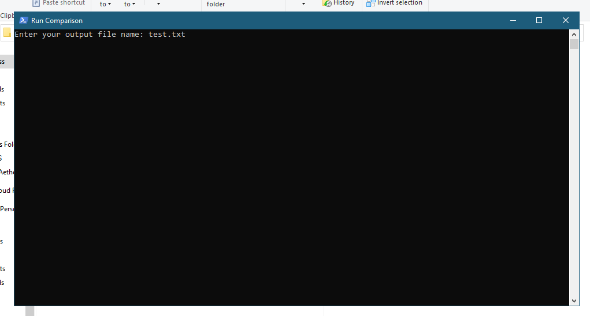
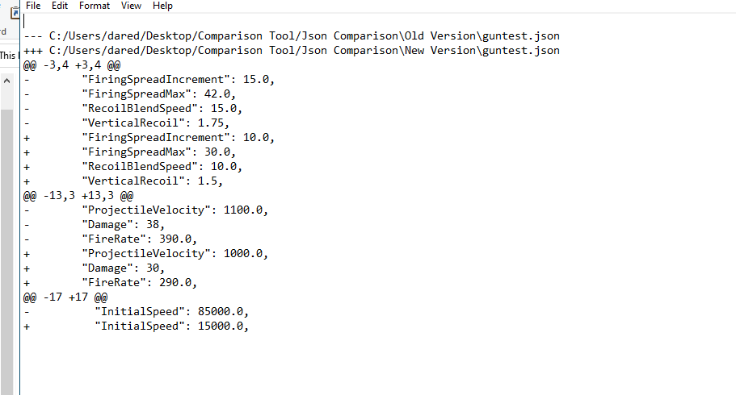

This is a simple python script that compares two folders, outputting the difference between the two in a text document with easy to read format. 
I use this for comparing two game versions of different games to see the changes that were made in the files, that were not documented. 

I know there's tools that do this already, but they lack the ability to output as a separate text document that can be shared, and most lack the ability to scan entire folders. I have no idea why, but there's a lack of json comparison tools that are simple to use, so I made this. 

I will not be going through how to install python in this. google it

# Installation
edit compare.py

change your path on line 5 to match wherever you place the main folder. **replace backslashes with forwardslashes**

Drop the first folder or json that you want to compare in "New Version"

Drop the 2nd folder or json that you want to compare in "Old Version"

Run the shortcut

name the output file whatever you'd like, put .txt at the end.

"+" are new lines added
"-" are lines removed
"+++" is the path of the folder in "New Version"
"---" is the path of the folder in "Old Version"

@@ is the line that the edit was made

missingfiles are folders/jsons that are missing that cannot be compared, from either New Version or Old Version

